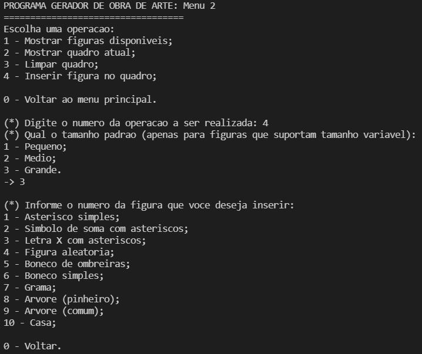

# Random Painting - Artworks

A random painting application developed in 2018 that can create paintings for you.
This application was proposed in a college assignment of the subject Algorithm Design and Analysis. The description (portuguese only) of this assignment can be found [here](Description-trabalho0PAA.pdf).

The full documentation (portuguese only) is [here](Documentation-Obra_de_Arte.pdf).

**requirements:**
- GCC version 9.3.0 (recommended)

# Executing

You can execute **make** to compile and **make run** to execute.

The start menu:
- You can generate paintings containing only asterisks (1), sum symbol made of asterisks (2), X letter made of asterisks (3);
- Option 4: You can generate random paintings involving figures of options 1, 2 and 3;
- Option 5: You can generate a random painting with elements of the bundle called "The Village" (similar to RPG elements);
- Option 6: The same as options 4, but also including elements of option 5;
- Option 7: Opens the "More options" menu.

More options:
- You can see the available figures (1), show the current painting (2), clear the painting (3) and insert figure at a random position in your painting (4).

Inserting figure in the painting (random position):
- You can choose the size of some figures: small (1), medium (2) and big (3).
- You can insert a simple asterisk (1), a sum symbol (2), a X letter (3), a random figure (4), a dummy with shoulder pats (5), a simple dummy (6), a grass (7), a pine (8), a simple tree (9) and a house (10).

A randomly generated painting:

Copyright © 2021 Daniel Freitas Martins (dnlfm)